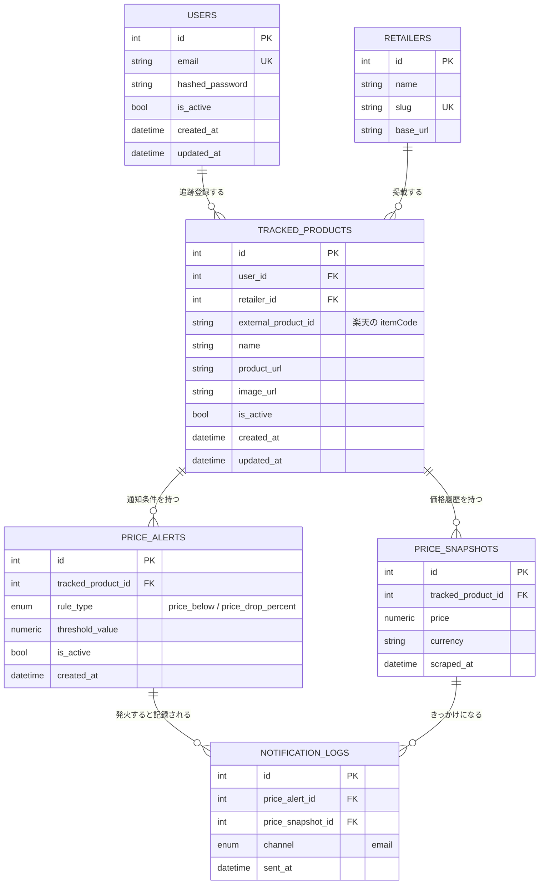

# ER図(v1: 楽天市場の価格監視のみ)

SNSキーワード監視は将来拡張として設計上は考慮するが、テーブルはまだ作らない(まずは楽天市場の価格監視だけで一通り動かす)。

## 設計判断

- **`tracked_products` はユーザーに紐づける**: 「競合の商品を自分が監視対象として登録する」形にすることで、JWT認証・CRUD要件を自然に満たせる。複数ユーザーが同じ商品を登録しても別レコードとして扱う(シンプルさ優先。将来、商品マスタとユーザーの追跡設定を分離するリファクタは選択肢として残す)。
- **`retailers` をテーブルとして独立させる**: 現時点では楽天市場のみだが、対象ECサイトが増える前提を見せるために正規化しておく。`slug` を業務キーとして使う。
- **価格は `price_snapshots` に時系列で貯める**(`tracked_products` に最新価格を持たせない): グラフ描画・変動率計算に生データが必要なため。最新価格は「直近の1件を取得するクエリ」で出す設計にする。
- **アラート条件と通知履歴を分離する**(`price_alerts` / `notification_logs`): 「条件」と「実際に送った記録」を分けることで、通知の再送防止・監査ログとしての利用がしやすくなる。
